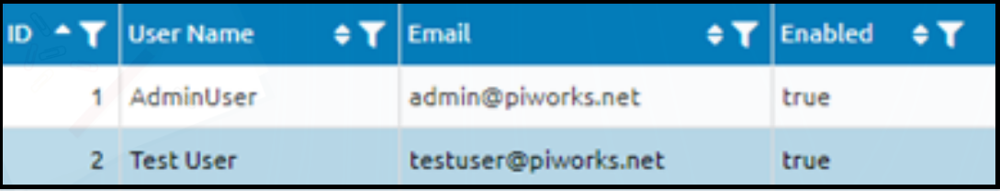
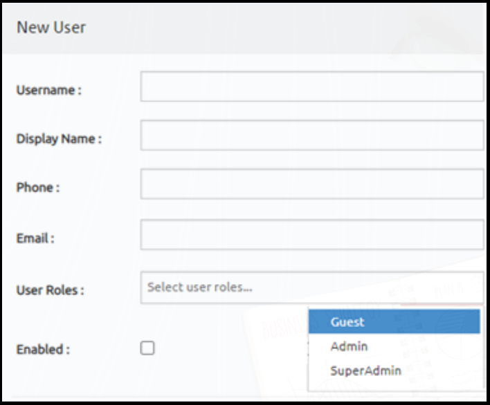

# User Management Page Specification Document
This page contains details about the UI components found on the user management page, the behavior of the page when using these components, what will be shown to the user at startup.

## Introduction
- User Management Page includes 3 components, at the top of the page users will see [PageHeader](#PageHeader) component. Under the Page Header there is [UserList](#UserList) component. When the user clicks the "+New User" Button [UserForm](#UserForm) will be appear. After user filled the form, "Save User" Button will be activated. After "Save User" Button action [UserForm](#UserForm) will be submitted.

## Table of Contents
- [Components](#components)
- [Actions](#actions)

## Components
  - ### PageHeader
     
    - Header component has 3 item 
      - "+New User" Button
      - "Hide Disabled User" Checkbox
      - "Save User" Button

  - ### UserList
     
    - The columns it contains
      - ID
      - User Name
      - Email
      - Enabled

  - ### UserForm
     
    - Includes: 
      - Username Input
      - Display Name Input
      - Phone Input
      - Email Input
      - User Roles Dropdown List(Guest,Admin,Super Admin)
      - Enabled Checkbox

## Actions
- +New User
  - UserForm component displays
- Save User
  - Saves the user created in the UserForm
- Filter 
  - Located to the right of each column heading in the table and filters for each column
- Hide Disabled User
  - Removes disabled users in the UserList
